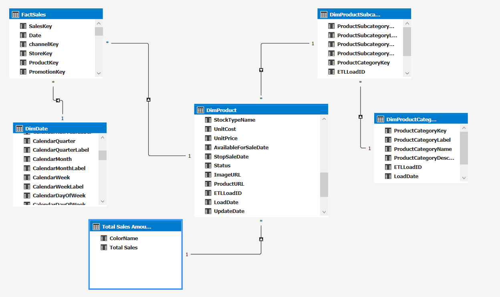
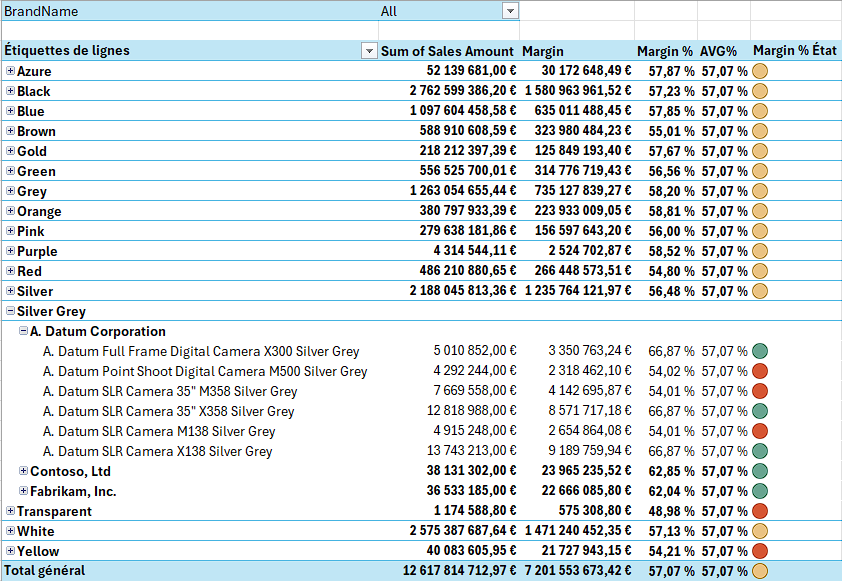
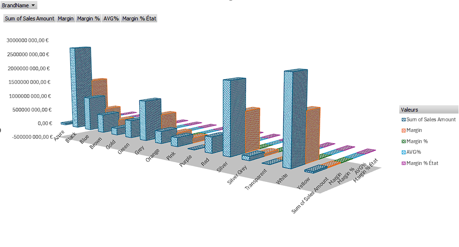
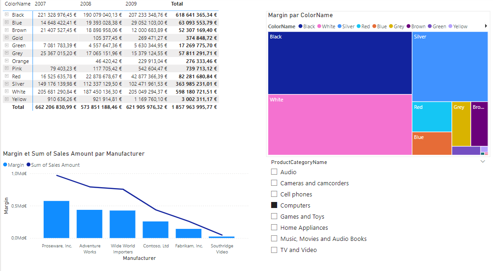
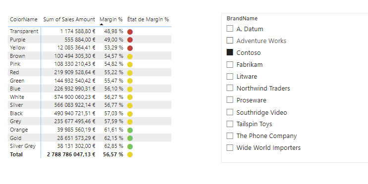
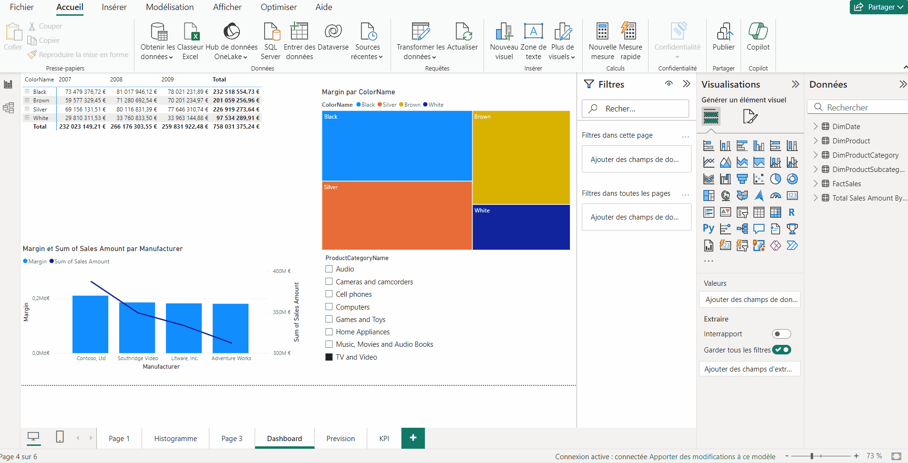

# PROJET Contoso
 
## Table de matière
- [PROJET Contoso](#projet-contoso)
  - [Table de matière](#table-de-matière)
  - [Introduction](#introduction)
  - [Modèle Tabulaire](#modèle-tabulaire)
  - [Excel](#excel)
    - [Pivot Table](#pivot-table)
    - [Histogramme](#histogramme)
  - [PBI](#pbi)
    - [Visuelle 1](#visuelle-1)
    - [Visuelle 2](#visuelle-2)
    - [Animation](#animation)
  - [Conclusion](#conclusion)
 
 
 
## Introduction
 
Ceci est un Projet d'analyse de donné avec SSAS, Excel et PowerBI basé sur la base de donné Contoso
 
 
## Modèle Tabulaire
 
 
 
 
## Excel
  
### Pivot Table
 
### Histogramme
 
 
## PBI
### Visuelle 1
  
### Visuelle 2
 

### Animation
 
## Conclusion
 
 